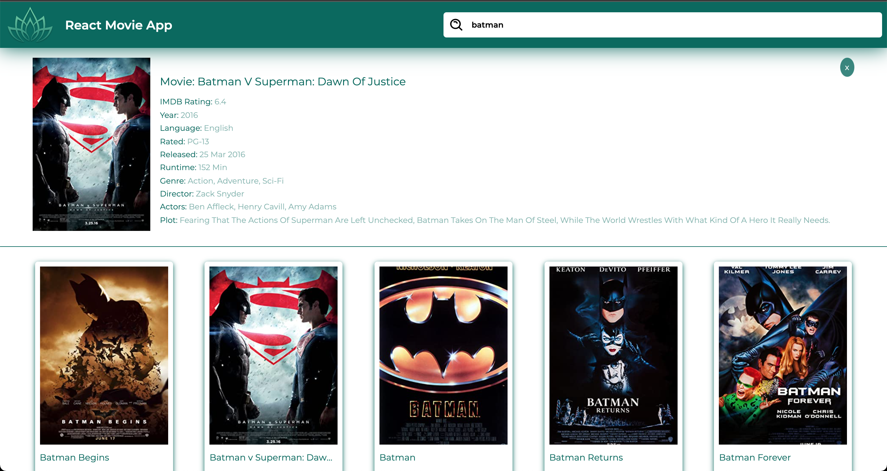

### API Used

[The Open Movie Database APIs](http://www.omdbapi.com/)

### API

- Method: `GET`
- Search URL: `https://www.omdbapi.com/?s={MOVIE_NAME}&apikey={API_KEY}`
- Movie DEtails URL: `https://www.omdbapi.com/?i={MOVIE_ID}&apikey={API_KEY}`

---

### Libraries used

- `styled-components`
- `axios`
- `react-js`

---

### Font

- Font Link: [fonts.google.com](https://fonts.google.com/specimen/Montserrat?query=m)

